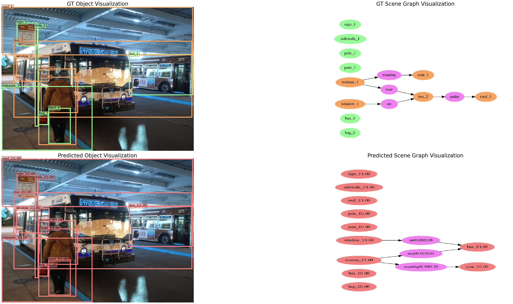

# TGIR

## Introduction

This repository contains the code for TGIR method

. 

### Major features

- **Modular design**

  We decompose the framework into different components and one can easily construct a customized scene graph generation framework by combining different modules.

- **Support of multiple frameworks out of box**

  The toolbox directly supports popular and contemporary detection frameworks, *e.g.* Faster RCNN, Mask RCNN, etc.

- **Visualization support**

  The visualization of the groundtruth/predicted scene graph is integrated into the toolbox.

## License

This project is released under the [MIT license](LICENSE).

## Installation

As our project is built on mmdetection 1.x (which is a bit different from their current master version 2.x), please refer to [INSTALL.md](docs/INSTALL.md). 
If you want to use mmdetection 2.x, please
 refer to [mmdetection/get_start.md](https://github.com/open-mmlab/mmdetection/blob/master/docs/get_started.md).

## Getting Started

Please refer to [GETTING_STARTED.md](docs/GETTING_STARTED.md) for using the projects. We will update it constantly.

## Acknowledgement

We appreciate the contributors of the [mmdetection](https://github.com/open-mmlab/mmdetection) project and [Scene-Graph-Benchmark.pytorch](https://raw.githubusercontent.com/KaihuaTang/Scene-Graph-Benchmark.pytorch/master/README.md) which inspires our design. 
